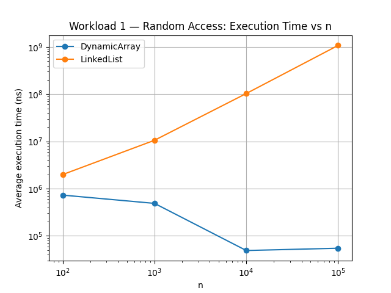
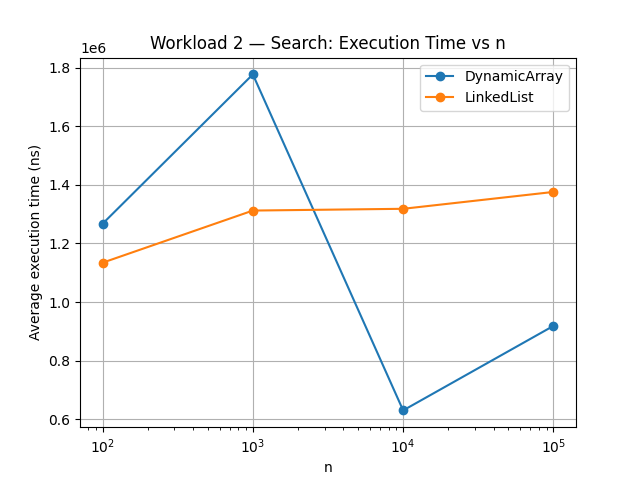
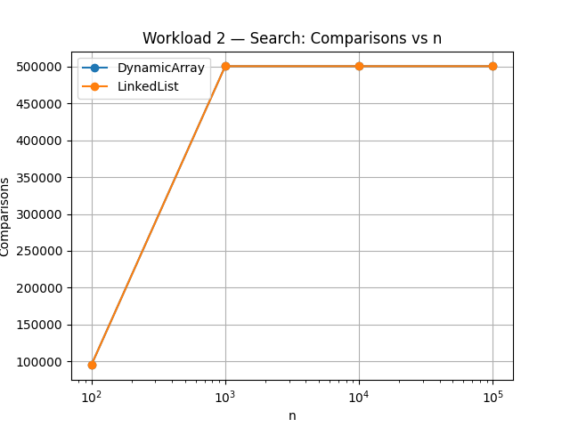
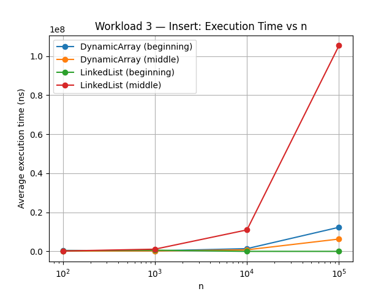
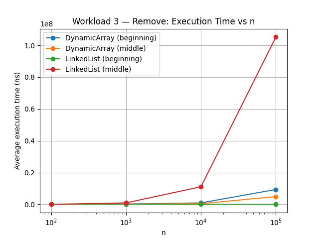
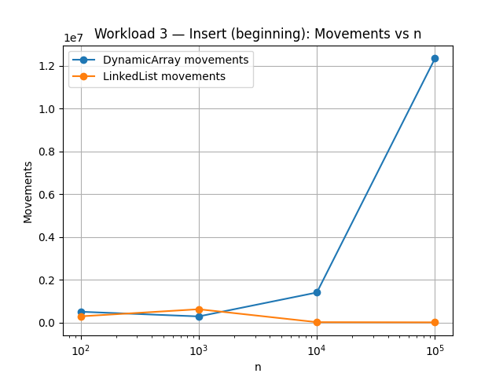
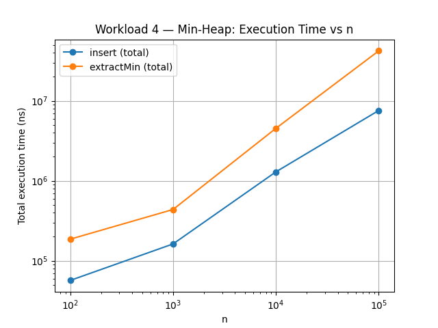
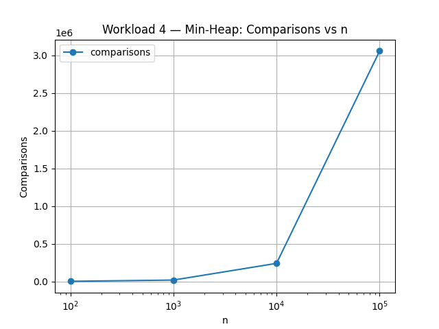

# Assignment 2 — Algorithmic Analysis, Correctness and Performance Trade-offs

## 1. Overview

This project implements and analyzes three fundamental data structures — **Dynamic Array**, **Linked List**, and **Min-Heap** — in Java. Beyond basic implementation, the project focuses on:

- proving correctness of key operations using loop invariants;
- deriving asymptotic complexity (Best, Average, Worst case, and auxiliary space) for all operations;
- empirically benchmarking the structures under four controlled workloads across increasing input sizes (n = 100, 1,000, 10,000, 100,000);
- comparing theoretical predictions against measured performance.

## 2. Complexity Analysis

| Structure | Operation | Best | Average | Worst | Auxiliary Space |
|---|---|---|---|---|---|
| Dynamic Array | `add(x)` | Θ(1) | Θ(1) amortized | O(n) | O(1) amortized, O(n) worst (resize) |
| Dynamic Array | `add(index, x)` | Ω(1) | Θ(n) | O(n) | O(1) |
| Dynamic Array | `remove(index)` | Ω(1) | Θ(n) | O(n) | O(1) |
| Dynamic Array | `get(index)` | Θ(1) | Θ(1) | Θ(1) | O(1) |
| Dynamic Array | `contains(x)` | Ω(1) | Θ(n) | O(n) | O(1) |
| Linked List | `add(x)` | Θ(1) | Θ(1) | Θ(1) | O(1) |
| Linked List | `add(index, x)` | Ω(1) | Θ(n) | O(n) | O(1) |
| Linked List | `remove(index)` | Ω(1) | Θ(n) | O(n) | O(1) |
| Linked List | `get(index)` | Ω(1) | Θ(n) | O(n) | O(1) |
| Linked List | `contains(x)` | Ω(1) | Θ(n) | O(n) | O(1) |
| Min-Heap | `insert(x)` | Ω(1) | Θ(log n) | O(log n) | O(1) amortized, O(n) worst (resize) |
| Min-Heap | `peekMin()` | Θ(1) | Θ(1) | Θ(1) | O(1) |
| Min-Heap | `extractMin()` | Ω(log n) | Θ(log n) | O(log n) | O(1) |

### Justification

**Dynamic Array `add(x)`** appends in Θ(1) unless the backing array is full, triggering a resize that copies all n elements — O(n) in that single case. Because doubling happens only every log n insertions, the **amortized** cost remains Θ(1).

**Dynamic Array `add(index, x)` / `remove(index)`** achieve their best case Ω(1) at `index = size` (insert) or on a single-element structure (remove), since no shifting occurs. The worst case O(n) occurs at `index = 0`, requiring every remaining element to shift. The average case is Θ(n), since a random index shifts n/2 elements on average.

**Dynamic Array `get(index)`** is Θ(1) always — direct pointer arithmetic regardless of n or position, which is the core structural advantage of contiguous memory.

**Linked List `get`, `add(index, x)`, `remove(index)`** all require traversal from `head`, so Θ(n) in general. The only Ω(1) cases are `index = 0` (direct head access) or `index = size` for `add` (thanks to the maintained tail pointer). A key distinction from arrays: even when the actual mutation is cheap (inserting at the head is just a pointer swap), the **traversal to reach any other position** remains expensive.

**Linked List `contains(x)`** requires a full linear scan, Θ(n) — asymptotically identical to the array's `contains`, though in practice the array outperforms it due to cache locality (confirmed in Workload 2 results below).

**Min-Heap `insert(x)`** appends to the end (Θ(1) array access) then sifts up at most log₂n levels. Best case Ω(1) occurs when the new element is already ≥ its parent, requiring no sift.

**Min-Heap `peekMin()`** is Θ(1) always, since the minimum is invariantly stored at the root.

**Min-Heap `extractMin()`** removes the root, moves the last element there, and sifts it down. Unlike `insert`, even the best case requires at least one comparison against the children — Ω(log n), not Ω(1) — meaning `extractMin` always performs work on the order of log n, while `insert` occasionally terminates instantly.

### Notable differences between operations with the same signature

- **`get(index)`**: Θ(1) for Dynamic Array vs Θ(n) for Linked List — same method signature, radically different cost due to physical memory layout (contiguous vs scattered nodes).
- **Insertion/removal at position 0 vs size**: for Dynamic Array these are opposite extremes (O(n) at the front, Θ(1) at the back); for Linked List it's reversed (O(1) at the front via `head`, Θ(1) at the back via `tail`), while both structures degrade to Θ(n) for arbitrary middle positions.
- **`insert` vs `extractMin`**: both Θ(log n) on average, but `insert` can finish in O(1) in the best case, while `extractMin` cannot, since at least one comparison against the new root's children is unavoidable.

## 3. Correctness

Two loop invariants were proven for non-trivial looping operations.

### Invariant 1 — `DynamicArray.add(index, x)` (right-shift loop)

```java
for (int i = size; i > index; i--) {
    data[i] = data[i - 1];
}
data[index] = x;
```

**Invariant:** Before each iteration (at value `i`), the subarray `data[i..size]` contains the same elements as the original subarray `data[i-1..size-1]`, shifted one position to the right, while `data[0..i-1]` remains untouched and equal to its original values.

**Initialization:** Before the first iteration, `i = size`. The range `data[size..size]` is empty, so the invariant holds trivially — nothing has been shifted yet, and `data[0..size-1]` is the untouched original array.

**Maintenance:** Assume the invariant holds before an iteration with the current `i`. The loop body executes `data[i] = data[i-1]`, copying the element at `i-1` into position `i`. After decrementing `i`, the range `data[i..size]` (using the new, smaller `i`) now correctly contains the shifted elements including the one just copied, while `data[0..i-1]` remains untouched.

**Termination:** The loop terminates when `i == index`. At this point, the invariant guarantees that `data[index+1..size]` contains exactly the original elements from `data[index..size-1]`, shifted right by one, and `data[0..index-1]` is unchanged.

**Proof of correctness:** After the loop, `data[index] = x` executes. Combined with the invariant at termination — left elements untouched, right elements shifted by one, and the target slot now holding `x` — this is exactly the specification of a correct insertion at `index`.

### Invariant 2 — `MinHeap.siftDown` (heap restoration after `extractMin`)

```java
while (true) {
    int left = 2*index+1, right = 2*index+2, smallest = index;
    if (left < size && data[left] < data[smallest]) smallest = left;
    if (right < size && data[right] < data[smallest]) smallest = right;
    if (smallest == index) break;
    swap(index, smallest);
    index = smallest;
}
```

**Invariant:** Before each iteration, every subtree of the heap except the one rooted at `index` satisfies the min-heap property (parent ≤ both children), while `data[index]` may temporarily violate the property relative to its children.

**Initialization:** Before the first iteration, `index` is the root, holding the last element moved there after removing the minimum. All other subtrees were untouched by this operation and, since the heap was valid before `extractMin`, satisfy the heap property. Only the root may violate it — the invariant holds trivially.

**Maintenance:** Assume the invariant holds before an iteration. The loop finds `smallest`, the index of the minimum among `data[index]` and its existing children. If `smallest != index`, a swap places a value ≤ both (former) children at `index`, restoring the local heap property there, while the potential violation moves strictly downward to the new `index = smallest`. All other subtrees remain untouched and valid. The invariant holds for the new `index`.

**Termination:** The loop terminates when `smallest == index`, meaning the current element is not greater than either child. At this point every subtree except `index`'s is valid (by the invariant), and `index`'s subtree is now valid too (guaranteed by the exit condition).

**Proof of correctness:** Since the potential violation strictly decreases in tree depth each iteration (bounded by the tree height, log n), and the loop only exits once no violation remains, the heap is fully valid — parent ≤ children everywhere — when the loop terminates, which is exactly the required post-condition of `extractMin`.

## 4. Experimental Setup

- **Values of n:** 100, 1,000, 10,000, 100,000 (initial elements in the structure).
- **Values of m:** 10,000 accesses (Workload 1), 1,000 searches (Workload 2), 1,000 insertions/removals per position (Workload 3), n insertions + n extractions (Workload 4).
- **Workloads:** Random Access, Search, Insertion/Removal (beginning & middle), Priority Processing (Min-Heap).
- **Repetitions:** each experiment run 5 times, average execution time reported.
- **Timing method:** `System.nanoTime()`, measured strictly around the operation loop, excluding input generation.
- **Random seed:** `new Random(42)` for all data and query generation, ensuring reproducibility.

## 5. Results

### Workload 1 — Random Access (`get`)

| n | Structure | Avg Time (ns) | Accesses | Theoretical |
|---|---|---|---|---|
| 100 | DynamicArray | 729,120 | 10,000 | Θ(1) |
| 100 | LinkedList | 1,984,020 | 10,000 | Θ(n) |
| 1,000 | DynamicArray | 487,260 | 10,000 | Θ(1) |
| 1,000 | LinkedList | 10,554,660 | 10,000 | Θ(n) |
| 10,000 | DynamicArray | 48,960 | 10,000 | Θ(1) |
| 10,000 | LinkedList | 103,180,880 | 10,000 | Θ(n) |
| 100,000 | DynamicArray | 54,740 | 10,000 | Θ(1) |
| 100,000 | LinkedList | 1,075,677,180 | 10,000 | Θ(n) |



### Workload 2 — Search (`contains`)

| n | Structure | Avg Time (ns) | Comparisons | Theoretical |
|---|---|---|---|---|
| 100 | DynamicArray | 1,267,140 | 95,050 | Θ(n) |
| 100 | LinkedList | 1,134,160 | 95,050 | Θ(n) |
| 1,000 | DynamicArray | 1,777,280 | 500,500 | Θ(n) |
| 1,000 | LinkedList | 1,312,280 | 500,500 | Θ(n) |
| 10,000 | DynamicArray | 629,820 | 500,500 | Θ(n) |
| 10,000 | LinkedList | 1,318,300 | 500,500 | Θ(n) |
| 100,000 | DynamicArray | 918,420 | 500,500 | Θ(n) |
| 100,000 | LinkedList | 1,375,880 | 500,500 | Θ(n) |




### Workload 3 — Insertion and Removal

| n | Structure | Operation | Position | Avg Time (ns) | Movements |
|---|---|---|---|---|---|
| 100 | DynamicArray | insert | beginning | 507,860 | 100,000 |
| 100 | DynamicArray | remove | beginning | 82,560 | 0 |
| 100 | LinkedList | insert | beginning | 292,400 | 0 |
| 100 | LinkedList | remove | beginning | 46,420 | 0 |
| 100 | DynamicArray | insert | middle | 199,140 | 50,000 |
| 100 | DynamicArray | remove | middle | 25,180 | 5,000 |
| 100 | LinkedList | insert | middle | 194,740 | 50,000 |
| 100 | LinkedList | remove | middle | 24,440 | 5,000 |
| 1,000 | DynamicArray | insert | beginning | 288,660 | 1,000,000 |
| 1,000 | DynamicArray | remove | beginning | 195,840 | 0 |
| 1,000 | LinkedList | insert | beginning | 624,760 | 0 |
| 1,000 | LinkedList | remove | beginning | 143,640 | 0 |
| 1,000 | DynamicArray | insert | middle | 238,980 | 500,000 |
| 1,000 | DynamicArray | remove | middle | 190,860 | 500,000 |
| 1,000 | LinkedList | insert | middle | 1,133,320 | 500,000 |
| 1,000 | LinkedList | remove | middle | 930,620 | 500,000 |
| 10,000 | DynamicArray | insert | beginning | 1,406,280 | 10,000,000 |
| 10,000 | DynamicArray | remove | beginning | 919,600 | 0 |
| 10,000 | LinkedList | insert | beginning | 20,100 | 0 |
| 10,000 | LinkedList | remove | beginning | 12,640 | 0 |
| 10,000 | DynamicArray | insert | middle | 808,400 | 5,000,000 |
| 10,000 | DynamicArray | remove | middle | 430,840 | 5,000,000 |
| 10,000 | LinkedList | insert | middle | 10,998,800 | 5,000,000 |
| 10,000 | LinkedList | remove | middle | 11,089,300 | 5,000,000 |
| 100,000 | DynamicArray | insert | beginning | 12,350,360 | 100,000,000 |
| 100,000 | DynamicArray | remove | beginning | 9,352,340 | 0 |
| 100,000 | LinkedList | insert | beginning | 11,800 | 0 |
| 100,000 | LinkedList | remove | beginning | 7,960 | 0 |
| 100,000 | DynamicArray | insert | middle | 6,327,100 | 50,000,000 |
| 100,000 | DynamicArray | remove | middle | 4,879,820 | 50,000,000 |
| 100,000 | LinkedList | insert | middle | 105,439,500 | 50,000,000 |
| 100,000 | LinkedList | remove | middle | 105,243,640 | 50,000,000 |





### Workload 4 — Priority Processing (Min-Heap)

| n | Insert Time (ns) | Extract Time (ns) | Comparisons | Sorted |
|---|---|---|---|---|
| 100 | 56,840 | 186,380 | 1,069 | true |
| 1,000 | 162,560 | 438,000 | 17,322 | true |
| 10,000 | 1,294,380 | 4,529,320 | 239,284 | true |
| 100,000 | 7,578,200 | 42,171,240 | 3,059,283 | true |




## 6. Discussion

**Workload 1** confirms theory precisely: Dynamic Array's `get` stays essentially flat (tens of microseconds) across all n, while Linked List's `get` grows linearly, becoming over 19,000× slower than the array at n = 100,000 — a direct consequence of O(1) indexed access versus O(n) pointer traversal.

**Workload 2** shows both structures scaling similarly in comparisons (as expected — both are Θ(n) scans), but the Dynamic Array is consistently faster in wall-clock time at larger n due to **cache locality**: contiguous memory means sequential scanning hits the CPU cache far more effectively than following pointers scattered across the heap. This is a clear example of two algorithms sharing the same Big-O complexity yet differing in real performance due to constant factors and hardware effects.

**Workload 3** is the most revealing: at the beginning position, Linked List insertion/removal is dramatically faster at large n (e.g., ~12ms for Array vs ~0.01ms for List at n = 100,000) because List needs no traversal for `head` operations, while Array must physically shift the entire structure. At the middle position, the relationship flips for large n — List's traversal cost (Θ(n) to reach the midpoint) combined with poor cache locality makes it slower than Array's shift, which despite also being Θ(n), benefits from `System.arraycopy`'s optimized bulk memory operations.

**Workload 4** shows both `insert` and `extractMin` times growing consistent with Θ(log n) per operation (Θ(n log n) total for n operations), and comparisons growing at a similar rate. The `sorted = true` result across all n confirms the heap invariant proven in Section 3 holds in practice — extracted elements are always non-decreasing.

### Answers to Performance and Design Analysis questions

1. **How does increasing n affect each workload?** Access and search costs grow linearly for List but stay constant for Array (Workload 1); comparison counts grow linearly for both (Workload 2); shifting/traversal costs grow linearly, amplifying the gap between beginning vs middle operations (Workload 3); heap operation costs grow logarithmically per operation (Workload 4).
2. **Which results agree with theory?** All of them, in trend — Θ(1) access for Array, Θ(n) for List traversal-based operations, Θ(log n) for heap operations.
3. **Where do results differ from prediction?** Constant-factor effects: Array's `contains` outperforms List's despite identical Θ(n) complexity, due to cache locality; `System.arraycopy` gives Array's shifting a much better constant than a naive comparison would suggest.
4. **Why can two algorithms with the same Big-O have different running times?** Big-O ignores constant factors, memory access patterns, and hardware-level effects (cache hits/misses, branch prediction) — all of which materially affect real execution time.
5. **How do constant factors and implementation details affect performance?** Contiguous memory (Array) benefits from spatial locality and vectorized bulk copies; pointer-chasing (List) suffers cache misses per node, even when both are asymptotically Θ(n).
6. **Why is a Dynamic Array preferable for some workloads?** Constant-time indexed access and cache-friendly sequential operations make it ideal for random access and scanning-heavy workloads.
7. **When can a Linked List be useful?** When insertions/removals are concentrated at the head (or with an existing reference to the node), and index-based random access is rarely needed.
8. **Why is a Heap appropriate for priority-based processing?** It maintains a partial order allowing O(log n) insert and extract-min, avoiding the O(n log n) cost of keeping the entire collection fully sorted.
9. **How does workload influence structure choice?** The dominant operation pattern determines the ideal structure: random access → Array, frequent head insertion → List, repeated minimum extraction → Heap.

## 7. Design Recommendations

- **Dynamic Array**: best for workloads dominated by random access (`get`) or where cache-friendly sequential scans matter.
- **Linked List**: best when insertions/removals happen mostly at the head/tail and index-based access is rare.
- **Min-Heap**: best for any workload requiring repeated access to the current minimum (or maximum, with inverted comparison), such as scheduling or priority queues.

## 8. Conclusion

The experiments confirm that theoretical asymptotic analysis reliably predicts the general trend of performance as input size grows, but real-world execution time is also shaped by constant factors — memory layout, cache behavior, and low-level operations like `System.arraycopy`. Dynamic Array excels at indexed access and cache-friendly scans; Linked List excels at head-based mutations; Min-Heap efficiently supports priority-based processing with logarithmic-time operations. Choosing the right structure requires matching its strengths to the workload's dominant access pattern, not just its Big-O complexity in isolation.